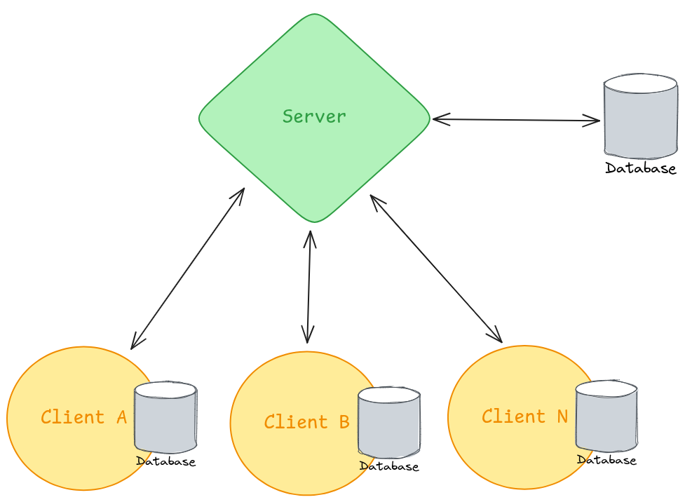
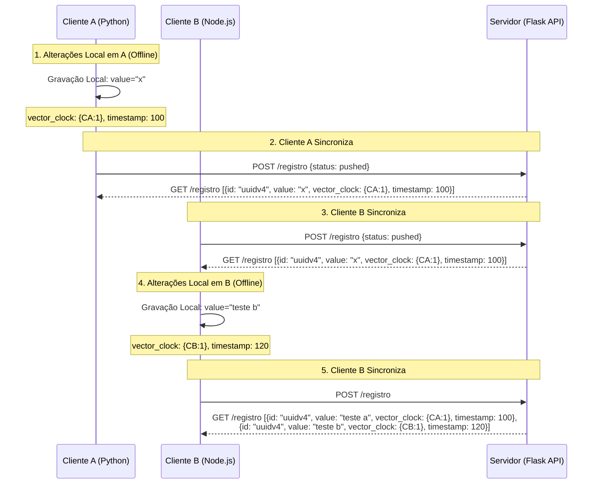
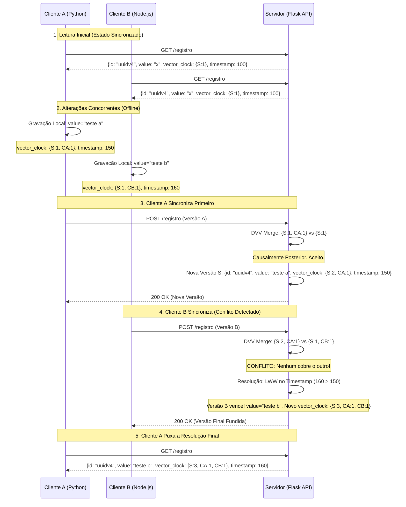

# Guia de Implementação

## Arquitetura



## Setup

### Ferramentas
- Docker
- IDE ou editor de arquivos
	- recomendação: VS Code
- Git (opcional)

### Repositório
[GitHub | Base de código para implementação](https://github.com/PedroLDallIgna/distributed-systems-impl/tree/master)
Pode ser realizado o clone do repositório via comando `git clone <url>` ou o download do arquivo ZIP com o repositório.
> **Importante**: realizar o clone/download da branch *master*

## Passo a passo da implementação

### Servidor
O código do servidor está no arquivo `server/app.py` do projeto.

#### Comparação dos Vector Clocks
A função `compare_vcs` é reponsável por comparar dois Vector Clocks (enviado (`sender`) e local (`receiver`)) e determinar a relação entre eles: se são iguais, se o enviado é posterior, se o local é posterior ou se eles são concorrentes.

> Para definir o resultado, será criado um *enum* dos possíveis resultados.

```python
class  VectorClockComparison(Enum):
	IGUAIS = 1
	SENDER_POSTERIOR = 2
	RECEIVER_POSTERIOR = 3
	CONCORRENTE = 4

def compare_vcs(vc_sender, vc_receiver):
    if vc_sender == vc_receiver:
        return VectorClockComparison.IGUAIS

    sender_is_causal = True
    receiver_is_causal = True

    all_nodes = set(vc_sender.keys()) | set(vc_receiver.keys())

    for node in all_nodes:
        sender_count = vc_sender.get(node, 0)
        receiver_count = vc_receiver.get(node, 0)

        if sender_count > receiver_count:
            # sender viu algo que o receiver não viu, então o receiver não é causal
            receiver_is_causal = False
        if receiver_count > sender_count:
            # receiver viu algo que o sender não viu, então o sender não é causal
            sender_is_causal = False

    if sender_is_causal and not receiver_is_causal:
        return VectorClockComparison.SENDER_POSTERIOR
    elif receiver_is_causal and not sender_is_causal:
        return VectorClockComparison.RECEIVER_POSTERIOR
    else:
        return VectorClockComparison.CONCORRENTE
```

#### Merge dos Vector Clocks

A função `merge_vcs()` recebe dois Vector Clocks como parâmetros (enviado (`sender`) e o local (`receiver`)) e realia o merge entre eles, mantendo o valor mais alto entre os dois para cada uma das chaves (nós).

```python
def merge_vcs(vc_sender, vc_receiver):
    merged = {}
    all_nodes = set(vc_sender.keys()) | set(vc_receiver.keys())
    for node in all_nodes:
        merged[node] = max(vc_sender.get(node, 0), vc_receiver.get(node, 0))
    return merged
```

#### Endpoint POST
A função `post_registro()` é responsável por gerenciar requisições POST para o *endpoint* `/registro` (`@app.post('/registro')`). A requisição POST receberá um JSON com os a lista dos registros cadastrados no nó (cliente) para serem sincronizados.

```python
@app.post('/registro')
def post_registro():
    data = request.get_json()
    app.logger.info("Recebendo: " + str(data))
    
    registers = data.get('registers', [])
    db = get_db()
    cur = db.cursor()

    for item in registers:
        vc_sender = item['vector_clock']
        vc_receiver = cur.execute(SELECT_VC_BY_ID_QUERY, (item['id'],)).fetchone()
        # mescla os vector clocks
        merged_vc = merge_vcs(vc_sender, vc_receiver[0] if vc_receiver != None else {})
        # compara os vector clocks
        vc_comparison = compare_vcs(vc_sender, vc_receiver[0] if vc_receiver != None else {})
        if vc_comparison == VectorClockComparison.SENDER_POSTERIOR:
            app.logger.info("Sender é posterior. Aceitando dados.")
            # aceita o dado do sender pois é posterior (atualiza o vector clock)
            item['vector_clock'] = merged_vc
            cur.execute(INSERT_REGISTER_QUERY, item)
        elif vc_comparison == VectorClockComparison.RECEIVER_POSTERIOR:
            app.logger.info("Sender é anterior. Rejeitando dados.")
            # rejeita o dado do sender pois é anterior (atualiza o vector clock)
            cur.execute(UPDATE_VC_BY_ID_QUERY, (merged_vc, item['id']))
        elif vc_comparison == VectorClockComparison.CONCORRENTE:
            app.logger.info("Conflito detectado entre dados. Verificando timestamps.")
            # vector clocks são concorrentes
            # verifica o timestamp para resolver o conflito
            timestamp_sender = item['timestamp']
            timestamp_receiver = cur.execute(SELECT_TIMESTAMP_BY_ID_QUERY, (item['id'],)).fetchone()[0]
            if timestamp_sender > timestamp_receiver:
                app.logger.info("Sender é mais recente. Aceitando dados.")
                # se o sender for mais recente, aceita o dado do sender (atualiza o vector clock)
                item['vector_clock'] = merged_vc
                cur.execute(INSERT_REGISTER_QUERY, item)
            else:
                app.logger.info("Receiver é mais recente. Rejeitando dados.")
                # se o receiver for mais recente, rejeita o dado do sender (atualiza o vector clock)
                cur.execute(UPDATE_VC_BY_ID_QUERY, (merged_vc, item['id']))

    db.commit()
    
    return {'status': 'pushed'}, 201
```

#### Endpoint GET

A função `get_registro()` é responsável por gerenciar requisições GET para o *endpoint*  `/registro` (`@app.get('/registro')`). A requisição GET receberá retornará uma lista dos registros cadastrados no servidor para os clientes sincronizarem.

```python
@app.get('/registro')
def get_registro():
    cur = get_db().cursor()
    cur.execute(SELECT_ALL_QUERY)
    rows = cur.fetchall()
    results = [
        {
            'id': row[0],
            'value': row[1],
            'vector_clock': row[2],
            'timestamp': row[3].isoformat()
        } for row in rows
    ]
    
    app.logger.info("Enviando: " + str(results))
    return {'registers': results}, 200
```

### Cliente Python

#### Sincronização dos dados

A função `push()` realiza uma requisição POST no servidor para atualizar o banco de dados centralizado do servidor e "estabelecer" os dados.

```python
def push():
    cur.execute(SELECT_ALL_QUERY)
    rows = cur.fetchall()
    data = [{'id': row[0], 'value': row[1], 'vector_clock': row[2], 'timestamp': row[3].isoformat()} for row in rows]
    if len(data) == 0:
        print('Nada para sincronizar.')
        return
    print("enviando: " + str(data))
    response = requests.post(f'{SERVER_URL}/registro', json={'registers': data})
    if response.status_code == 201:
        print("Dados enviados ao servidor com sucesso.")
```

A função `pull()` realiza uma requisição GET no servidor para atualizar o banco de dados local com os dados centrais "estabelecidos".

```python
def pull():
    response = requests.get(f'{SERVER_URL}/registro')
    if response.status_code == 200:
        data = response.json()
        if 'registers' in data and len(data['registers']) > 0:
            cur.executemany(SYNC_DATABASE_QUERY, data['registers'])
            con.commit()
        else:
            print('Nenhum dado recebido do servidor.')
```

## Execução

### Servidor

Para executar o servidor será utilizado um container do Docker, estabelecido por meio de dois arquivos: `server/Dockerfile`, para criar uma imagem Docker, e `docker-compose.yaml`, para executar o serviço a partir da imagem criada.

Portanto, para iniciar o servidor basta rodar o comando:

```shell
docker compose run --rm --build server
```
- a *flag*  `--rm` exclui o container quando finalizamos a execução com `Ctrl`+`C`.
- a *flag* `--build` executa o build da imagem definida no arquivo `server/Dockerfile` para criar um container a partir dela. Ela pode ser omitida caso não tenha sido feita nenhuma alteração no código (`server/app.py`).

### Cliente

Para executar o cliente será utilizado um container do Docker, estabelecido por meio de dois arquivos: `client-python/Dockerfile`, para criar uma imagem Docker, e `docker-compose.yaml`, para executar o serviço a partir da imagem criada.

Portanto, para iniciar o cliente basta rodar o comando:

```shell
docker compose run -it --rm --build client
``` 
- a *flag* `-it` executa o container de forma interativa, permitindo a interação do usuário.
- a *flag*  `--rm` exclui o container quando finalizamos a execução com `Ctrl`+`C`.
- a *flag* `--build` executa o build da imagem definida no arquivo `client-python/Dockerfile` para criar um container a partir dela. Ela pode ser omitida caso não tenha sido feita nenhuma alteração no código (`client-python/app.py`).

Assim que o cliente iniciar, um *prompt* pedirá para definir um nome para o cliente, o qual será utilizado para definir o nome do nó no Vector Clock.
Depois de definido um nome, será realizada a sincronização com o servidor (`push` e `pull`). 

Depois da sincronização, o cliente ficará disponível para interação com o usuário com as seguintes opções:
- `[S]ync`: sincronizar o estado local do banco com o do servidor. Basicamente é feito um push (envio para o servidor) e um pull (busca do servidor) dos registros.
- `[I]nsert`: inserir um dado no banco local do cliente.
- `[E]dit`: editar um dado no banco local do cliente.
- `[V]iew`: visualizar estado do banco local.
- `[Q]uit`: terminar a execução da aplicação cliente.

Para executar mais de uma instância/container do mesmo cliente, basta executar novamente o comando `docker compose run` mostrado acima em outro terminal.

> Ao iniciar mais de um mesmo cliente na mesma máquina, dê nomes diferentes para que a comparação dos Vector Clocks não cause problemas e funcione corretamente.

## Casos de Teste

### Cenário Causal

O cenário causal demonstra a ocorrência de alterações em sequência e sem conflito. O teste se baseará no diagrama de sequência abaixo:



#### Passo a Passo
 1. Executar o Servidor
 2. Executar Cliente A (Node ou Python) com nome único
 3. Executar Cliente B (Node ou Python) com nome único
 4. No cliente A:
	 1. Digite `I` para selecionar a opção de inserir valor localmente
	 2. Digite um valor para o registro
	 3. Digite `S` para selecionar a opção de sincronizar as alterações com o servidor
5. No cliente B:
	1. Digite `S` para selecionar a opção de sincronizar as alterações com o servidor
	2. Digite `I` para selecionar a opção de inserir valor localmente
	3. Digite um valor para o registro
	4. Digite `S` para selecionar a opção de sincroniar as alterações com o servidor  

### Cenário de Conflito

O cenário de conflito demonstra a ocorrência de alterações offline paralelamente resultando em conflito na sincronização. O teste se baseará no diagrama de sequência abaixo:



#### Passo a Passo
Podemos utilizar o estado do banco centralizado anterior para realizar o teste de conflito.

> Caso não tenha realizado o teste anterior, é aconselhado realizá-lo para possuir registros cadastrados no banco.

 1. Executar o Servidor (já realizado no teste anterior)
 2. Executar Cliente A (Node ou Python) com nome único (já realizado no teste anterior)
 3. Executar Cliente B (Node ou Python) com nome único (já realizado no teste anterior)
 4. No cliente A:
	 1. Digite `S` para selecionar a opção de sincronizar as alterações com o servidor
	 2. Digite `E` para selecionar a opção de alterar um registro cadastrado localmente
	 3. Digite um número referente ao índice do registro na tabela para fazer a edição
	 4. Digite um novo valor para o registro
5. No cliente B:
	 1. Digite `E` para selecionar a opção de alterar um registro cadastrado localmente
	 2. Digite um número referente ao índice do registro na tabela para fazer a edição (selecione o mesmo item alterado no Cliente A; verifique o valor, pois o índice da tabela pode ser diferente)
	 3. Digite um novo valor para o registro
6. No cliente A:
	1.  Digite `S` para selecionar a opção de sincronizar as alterações com o servidor
7. No cliente B:
	1. Digite `S` para selecionar a opção de sincronizar as alterações com o servidor
	2. Digite `V` para visualizar o estado do banco
	3. O Vector Clock do registro deve estar com alterações de ambos os nós, mas com o valor alterado no Cliente B, pois foi a última alteração
8. No servidor:
	1. É possível verificar os logs emitidos pelo servidor para executar o merge dos dados
9. No cliente A:
	1. Digite `S` para selecionar a opção de sincronizar as alterações com o servidor
	2. Digite `V` para visualizar o estado do banco
	3. O Vector Clock do registro deve estar com alterações de ambos os nós, mas com o valor alterado no Cliente B, pois foi a última alteração

